#DITA TO PDF WITH ECLIPSE
This program runs inside [Eclipse](https://www.eclipse.org/), an [integrated development environment](https://en.wikipedia.org/wiki/Integrated_development_environment) (IDE) and is mainly a [Java](http://www.oracle.com/technetwork/java/index.html) based project in that all the code libraries use Java ([Apache FOP](https://xmlgraphics.apache.org/fop/), [Saxon](https://sourceforge.net/projects/saxon/files/Saxon-HE/), [DITA Open Toolkit](http://www.dita-ot.org/), [Apache ANT](http://ant.apache.org/)) and it also uses [XSL](https://www.w3.org/Style/XSL/) and [XML](https://www.w3.org/XML/) heavily.   Development was originally done in [oXygen XML Editor](https://www.oxygenxml.com/) then ported to Eclipse.

This project takes DITA XML as input and transforms it to [PDF](https://acrobat.adobe.com/au/en/products/about-adobe-pdf.html) with the DITA Open Toolkit and a custom made plugin using Apache Ant.  Using PDF allows us to print a nicely formated documents on paper. Using Eclipse generating the PDF output can be done in one click by building the project and this creates a publishing pipeline making all the different PDF's one after the other.

[Darwin Information Typing Architecture](https://en.wikipedia.org/wiki/Darwin_Information_Typing_Architecture) (DITA) is an XML data model for authoring and using DITA-OT you can publish those ideas. The DITA standard is maintained by the [OASIS](https://en.wikipedia.org/wiki/OASIS_(organization)) DITA Technical Committee. Some of the largest and most successful companies in the world use DITA. The next link is an informal list of [companies using DITA](http://www.ditawriter.com/companies-using-dita/)

The Roadmap for this project is to make this into an easy to follow tutorial on how to build and customize DITA-OT PDF plugins and publish your DITA content using Eclipse.  There maybe an attempt at building DITA-OT PDF plugins using newer versions of DITA-OT. 

The 'info.debrief' plugin has been extracted from another open source project I worked on. The other 'sample' plugin is a vanilla plugin that i created online on a DITA-OT plugin customization site.  

If you are not already Gung-Ho on Java and all things tech, then try a few short online courses:

- https://www.codecademy.com/learn/learn-java
- https://www.codecademy.com/learn/learn-the-command-line
- https://www.codeschool.com/courses/try-git
- https://www.codecademy.com/learn/learn-git

And then come train in the [REAL DOJO](http://www.codewars.com) and reach your highest potential, become faster, stronger and more powerful......JEDI MASTER LEVEL.....!??!?!!  

So now that you are the new Java Chuck Norris on the block, come and let's build.

##Build Instructions - Mac OS X

###Install Java

First you should check if Java is already installed on your system. 

In a terminal type the following commands:

####java -h

If Java is not installed you need to install the Java Development Kit (JDK) as Eclipse needs Java to run so you should first read the [Java Platform, Standard Edition Installation Guide](https://docs.oracle.com/javase/8/docs/technotes/guides/install/install_overview.html)

So then go to: http://www.oracle.com/technetwork/java/javase/downloads/jdk8-downloads-2133151.html

Choose the JDK version for your [Operating System](https://en.wikipedia.org/wiki/Operating_system).

If it's installed you can read up about Java more by typing:

####java -version

###Download Eclipse 

Go to: [Eclipse Downloads](https://www.eclipse.org/downloads/?osType=macosx)

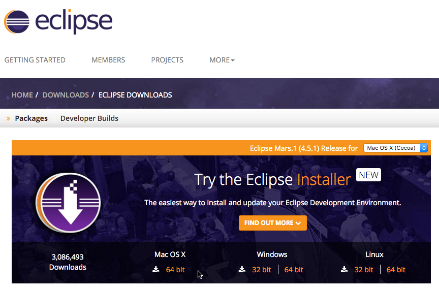

In the box near top labelled "Try the Eclipse Installer", click on "64 bit" under "Mac OS X".

Download Eclipse installer application.

Before you install Eclipse you should check the checksum of the Eclipse file.

Depending on which type of checksum you choose: MD5, SHA1, SHA-512 the commands are slightly different:

First you should click on the checksum type in the image below:

I used SHA-512 so the in a terminal in the directory or folder where you downloaded the Eclipse package to, the command to type would be: 

###shasum -a 512 filename

You should check the output of the shasum command matches what's displayed on the Eclipse website for the type of checksum you choose.  You can select the text in the terminal and then copy it and then find it on the Eclipse website.

For more information on the shasum or md5 command open a terminal and type:

####man shasum  

####man md5

Use the up and down arrows on the keyboard to navigate through the man page documentation.

To exit from the man pages type: q

###Install Eclipse

Unzip resulting download (eclipse-inst-mac64.tar.gz) by double-clicking on it if downloader did not already unzip it.

Run "Eclipse Installer" application.

Choose "Eclipse IDE for Java Developers" option. (Other options and Eclipse modules are not necessary for this build.)

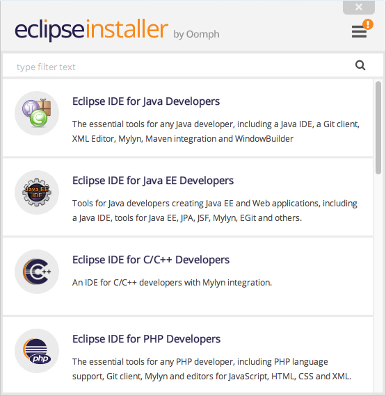

This option allows you to specify an "Installation Folder." The default option may be a folder within your individual directory.

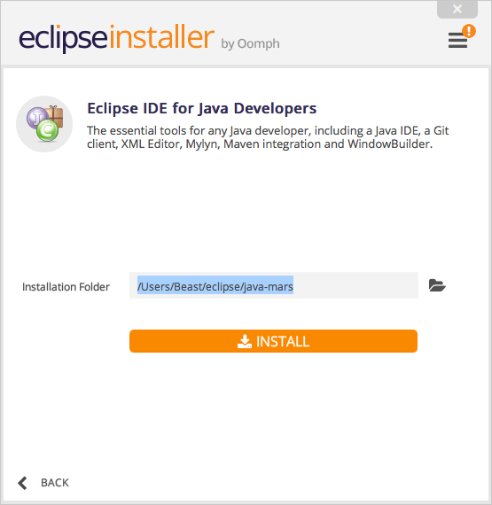

It will be more useful to change this and install Eclipse within a directory titled "Eclipse" within the system's main Application directory.

Click on the folder icon to navigate to the Applications directory and create an "Eclipse" target sub-directory before installing.

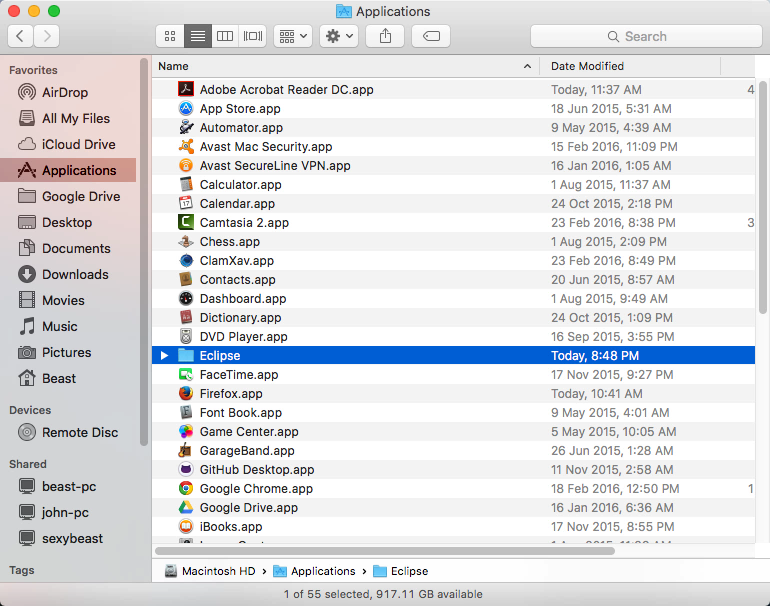

Then click the "Install" button.

You will be presented with the Eclipse Foundation Software User Agreement, so click "Accept Now" after reading it. 

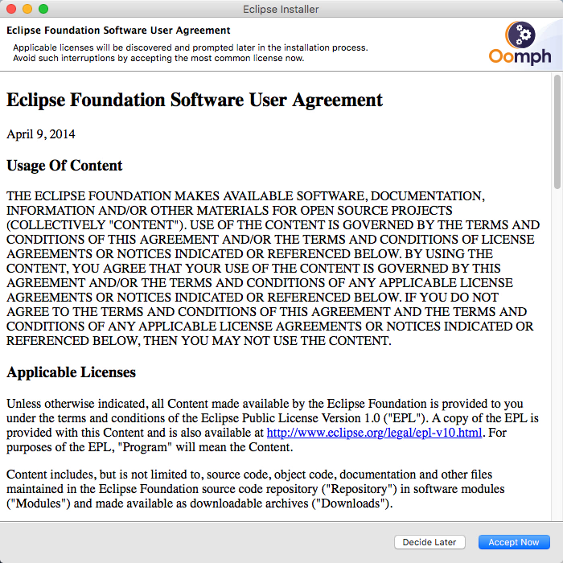

The installation process may take a few minutes and you will be presented with a green "installing" loading bar style indicator.

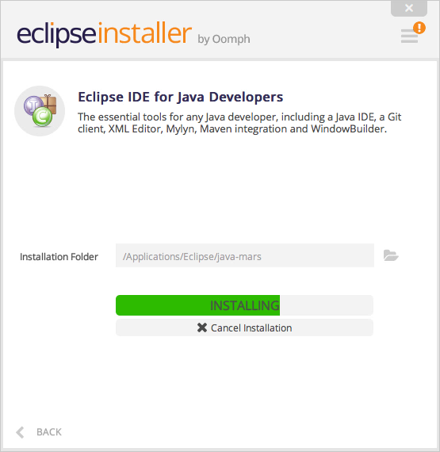

When Eclipse has finished installing you will be presented with the "Launch" green button.

Launch Eclipse for the first time. Doing so will ask you to Select a "workspace." The default option "/Users/[your username]/Documents/workspace" will work fine.

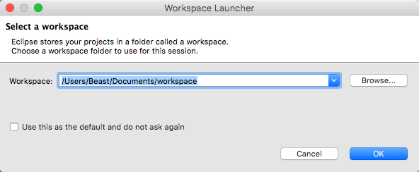

Quit Eclipse for now.	

###Install GitHub Desktop

The build's repository is found within GitHub, and the "GitHub Desktop" application will allow you to clone and work on the build more easily, while retaining a link to the primary source, and thus obtaining updates and having the option to submit modifications which could be candidates for inclusion.  GitHub Desktop is currently available for both OS X and Windows.

Go to: [GitHub Desktop](https://desktop.github.com/)

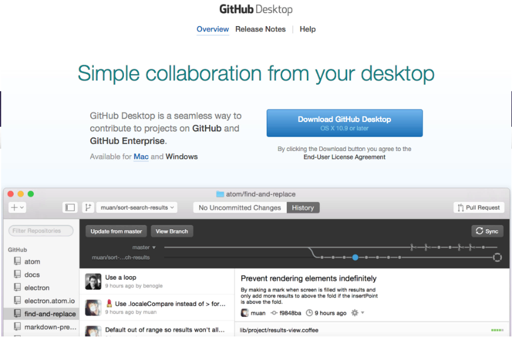

Click on the "Download GitHub Desktop" button.

Unzip the resulting file: GitHub Desktop 216.zip

This expands to: GitHub Desktop

###Clone GitHub repository

Switch your Eclipse workspace to the parent of the folder you cloned into

Then go -> File -> New -> Java Project -> click next

Enter 'dita-to-pdf-with-eclipse' in the Project Name field

Un-check location checkbox and enter in the parent folder of the project. In project layout select -> 'Use project folder as root for sources and class files' radio button and then click next.

On the next screen just click 'Finish'

You must add the JAR files from SaxonHE and DITA-OT to Ant inside Eclipse. Go Preferences -> Ant -> Runtime -> Classpath tab -> click Global Entries -> click Add JARs -> navigate to 'libs/DITA-OT1.8.5/lib' and add all the JAR files from that directory.  Click add JARS again and add 'saxon9he.jar' from  'libs/SaxonHE9-6-0-7J'.  Make sure to click Apply and then click Ok.
	
###Build and run project	
	
Right click on build.xml and select -> Run As -> Ant Build -> (first one)

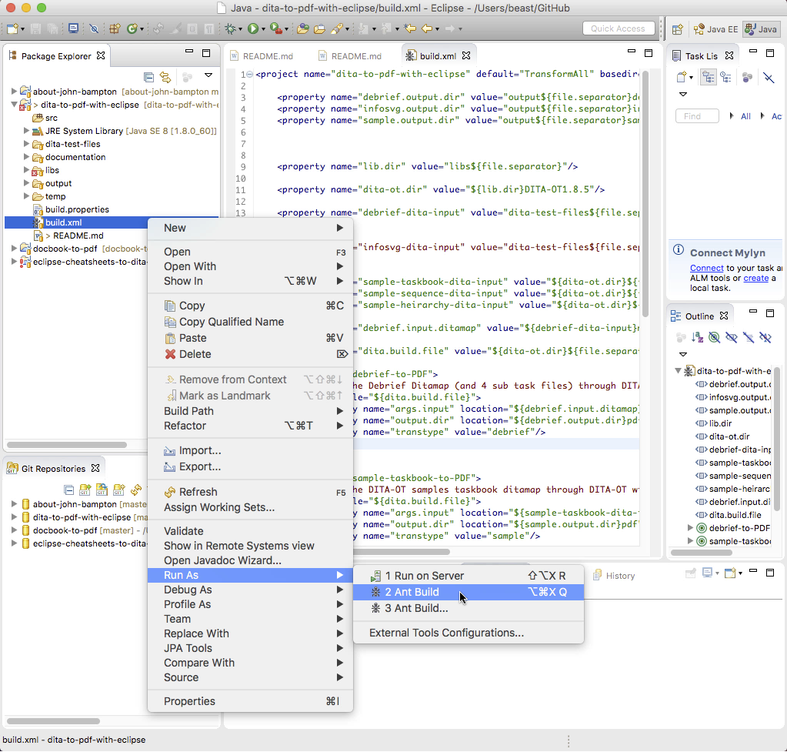

This should run and build and use as input both the DITA XML in the 'dita-test-files/debrief/' folder and the three ditamap's from the 'libs/DITA-OT1.8.5/samples' directory and will produce four PDF's in the  'output' sub folders 'output/debrief/pdf' and 'output/samples/pdf' folder.

Transformation and rendering (printing) occur in this step and the 'info.debrief' custom DITA-OT plugin produces a custom designed PDF via the DITA-OT base libraries, an XSL - Formatting Objects Processor (FO Processor) and the transformation engine SaxonHE.  The other plugin 'sample' is a vanilla plugin with very little customization that makes the three sample PDF's.

I used Apache FOP 2.0 for the FO Processor, DITA-OT 1.8.5 and SaxonHE9-6-0-7J from Saxonica as the transformation engine 

	

##How DITA-OT PDF Plugins work

Plugins are placed in the DITA-OT plugins directory.  You can see the plugin I built in this directory named 'info.debrief' and the auto built vanilla plugin named 'sample'.

When ready a plugin must be integrated into DITA-OT using Apache Ant. I built this project using OS X and I installed Ant through Homebrew. 
 
To integrate a new plugin on the command line from inside the root DITA-OT folder it would be -> ant -f integrator.xml

You can also run the integrator inside Eclipse as an Ant build by right clicking on '/libs/DITA-OT1.8.5/integrator.xml' and selecting -> Run As -> Ant Build and this should integrate the plugin with the toolkit.

Every plugin has a 'transtype' -> the two transtype's are 'debrief' and 'sample'

PDF Plugins are comprised of some XML config files, some artwork and some custom XSL (XSLT/XSL-FO/XPath) code 
DITA-OT provides that base XSL code that you 'override' with your custom work.

The two main files that configure plugins are plugin.xml and integrator.xml which should be in the root of the plugin folder.  The 'cfg' folder contains the rest of the customization.

Custom XSL can be placed in two XSL files both named custom.xsl.  I placed all the custom code at 'libs/DITA-OT1.8.5/plugins/info.debrief/cfg/fo/xsl/custom.xsl' for this project.  The other file is seen in the adjacent 'attrs' directory. 
 
Placing the custom code only in these two files follows best practice techniques on how to build a DITA-OT PDF plugin.

##Homebrew usage

[Homebrew](http://brew.sh) is an amazing package management system for OS X that installs the stuff you need that Apple didn't.

[Homebrew Formula](http://brewformulas.org) are written in Ruby.

A made a [video on Homebrew](https://www.youtube.com/watch?v=IonWEFStPio) which runs for under minute that shows the typical brew update command.

If you install Homebrew you should try to run brew update daily.

Once you have installed Homebrew you can run through the basic commands below.

###brew -v

###man brew
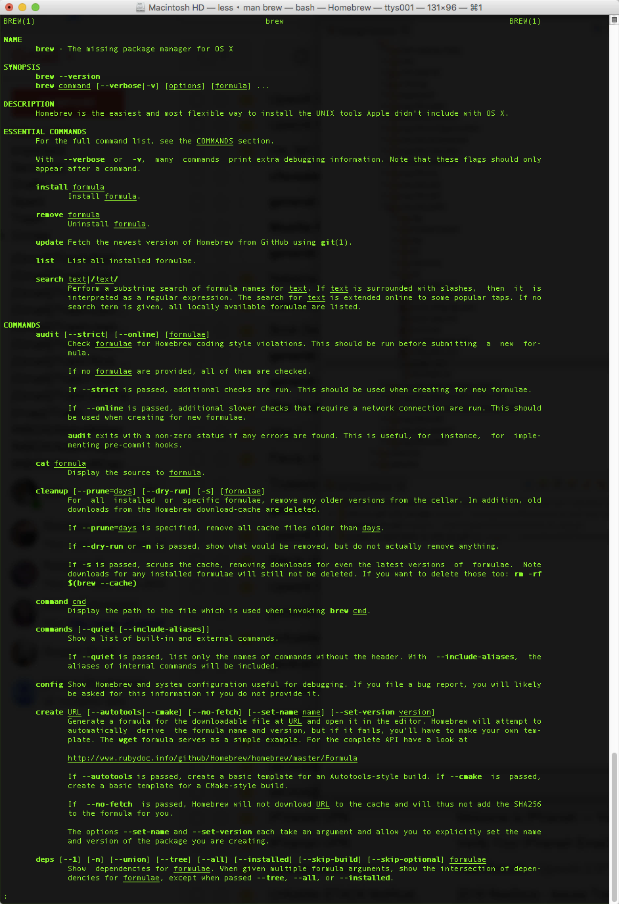

**Before using Homebrew you should ensure it's up to date. Run the next command:**

###brew doctor

###brew update

###Example output of running a brew install command.  The image shows pouring brews from their bottles
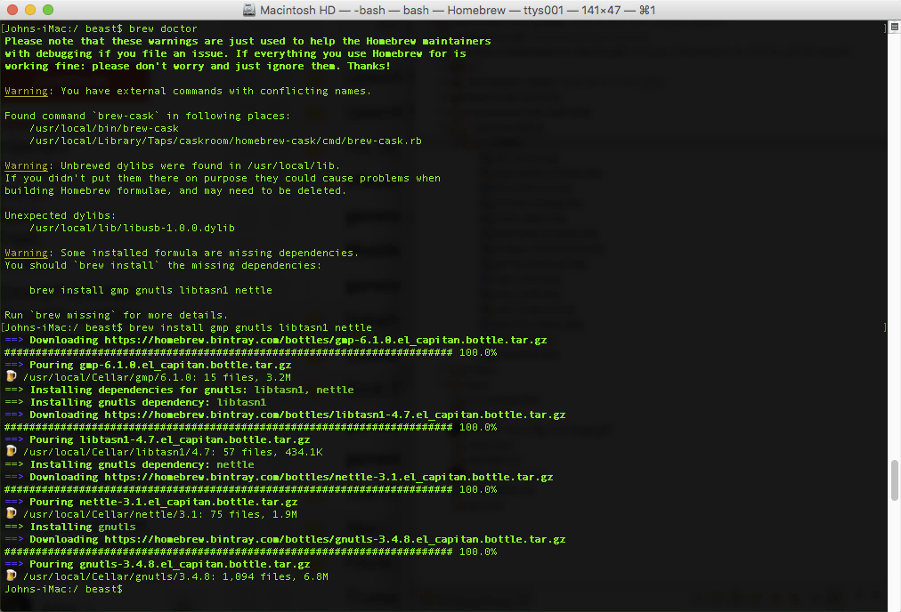

###brew list

##List of resources and technologies used on this GitHub project
	
Eclipse - https://eclipse.org/ 

The Apache Software Foundation - http://www.apache.org/

Apache FOP - https://xmlgraphics.apache.org/fop/

Apache ANT - http://ant.apache.org

Saxon XSLT - https://en.wikipedia.org/wiki/Saxon_XSLT

Saxon - http://saxon.sourceforge.net/

Saxonica - http://www.saxonica.com/welcome/welcome.xml

Online community for the Darwin Information Typing Architecture OASIS Standard - http://dita.xml.org/

DITA - https://en.wikipedia.org/wiki/Darwin_Information_Typing_Architecture

DITA-Open Toolkit - http://www.dita-ot.org/

W3C - The Extensible Stylesheet Language Family (XSL) - http://www.w3.org/Style/XSL/

W3C XSLT 2.0 - http://www.w3.org/TR/xslt20/ 

XSL Formatting Objects - https://en.wikipedia.org/wiki/XSL_Formatting_Objects

XSL-FO Processors - http://www.w3.org/community/ppl/wiki/XSL-FO_Processors

XML - https://en.wikipedia.org/wiki/XML

Adobe PDF - https://en.wikipedia.org/wiki/Portable_Document_Format

The Organization for the Advancement of Structured Information Standards (OASIS) - https://en.wikipedia.org/wiki/OASIS_(organization)

oXygen XML Editor - http://www.oxygenxml.com

DITA-OT installing plugins - http://dita-ot.sourceforge.net/1.7/dev_ref/plugins-installing.html

Generate sample DITA-OT plugin - https://dita-generator-hrd.appspot.com/pdf-plugin/

Creating DITA-OT plugins - http://dita-ot.sourceforge.net/1.5.4/dev_ref/plugins-overview.html

Customizing PDF output - http://www.dita-ot.org/1.8/readme/dita2pdf-customization.html

XSLT FAQ. Docbook FAQ. Braille. - http://www.dpawson.co.uk/

Homebrew — The missing package manager for OS X - http://brew.sh/

Apache Ant Wikipedia - https://en.wikipedia.org/wiki/Apache_Ant

Install Ant with Homebrew - http://brewformulas.org/Ant

Installing Apache Ant - http://ant.apache.org/manual/install.html

Codecademy - Learn the Command Line - https://www.codecademy.com/courses/learn-the-command-line

Codecademy - Learn Java - https://www.codecademy.com/learn/learn-java

Got 15 minutes and want to learn Git? https://try.github.io/levels/1/challenges/1

Ruby regular expression editor - http://rubular.com/

Essential programmer training - http://www.codewars.com/

Mastering Markdown - https://guides.github.com/features/mastering-markdown/

GitHub Desktop - https://desktop.github.com/

Microsoft File Checksum Integrity Verifier - https://www.microsoft.com/en-au/download/details.aspx?id=11533

TechSmith Camtasia - https://www.techsmith.com/camtasia.html

MD5 - https://en.wikipedia.org/wiki/MD5

sha1sum - https://en.wikipedia.org/wiki/Sha1sum

IDE - Integrated Development Environment - https://en.wikipedia.org/wiki/Integrated_development_environment

Git (software) - https://en.wikipedia.org/wiki/Git_(software)

man page - https://en.wikipedia.org/wiki/Man_page

Terminal (OS X) - https://en.wikipedia.org/wiki/Terminal_(OS_X)

[Back to top](#dita-to-pdf-with-eclipse)
